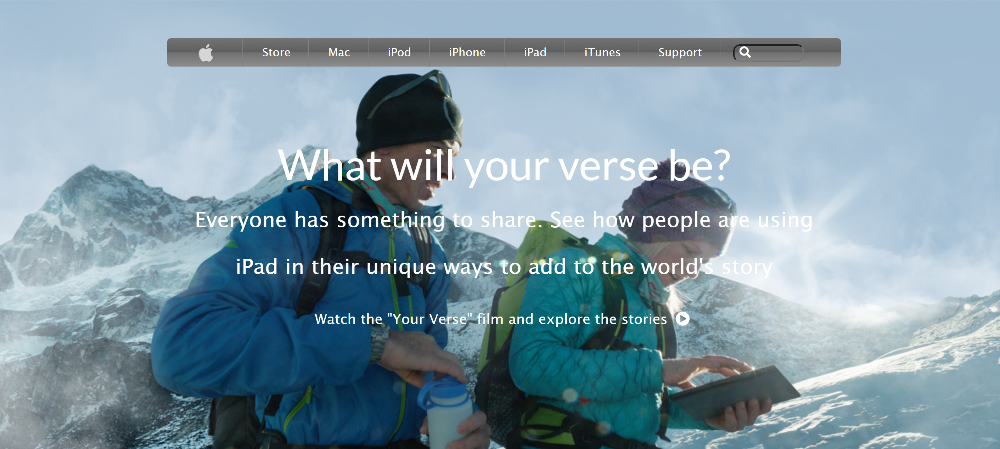

# Old Apple Website Clone

This page is a clone of the old apple website. In this project we applied flexbox, backgrounds, gradients and grid.

## Built With

- HTML
- CSS

## Live Demo

[Live Demo Link](https://compassionate-thompson-502b28.netlify.app/)

## Getting Started

**To visit the page go to the live demo link**

### Prerequisites

1. An internet browser
2. A computer

## Authors

👤 **Author1**

- Github: [@githubhandle](https://github.com/ershadul1)
- Twitter: [@twitterhandle](https://twitter.com/ErshadulRayhan)
- Linkedin: [linkedin](https://www.linkedin.com/in/ershadul-hakim-rayhan-a5a17649/)

👤 **Author2**

- Github: [@githubhandle](https://github.com/Haywhizzz )
- Twitter: [@twitterhandle](https://twitter.com/Haywhizzz)
- Linkedin: [linkedin](https://www.linkedin.com/in/oyeleke-ayomide-b962421a6/)

## 🤝 Contributing

Contributions, issues and feature requests are welcome!

Feel free to check the [issues page](https://github.com/Haywhizzz/Old-Apple-clone/issues).

## Show your support

Give a ⭐️ if you like this project!

## Acknowledgments

Thanks to Microverse for inspiring us.

## 📝 License

This project is [MIT](lic.url) licensed.
